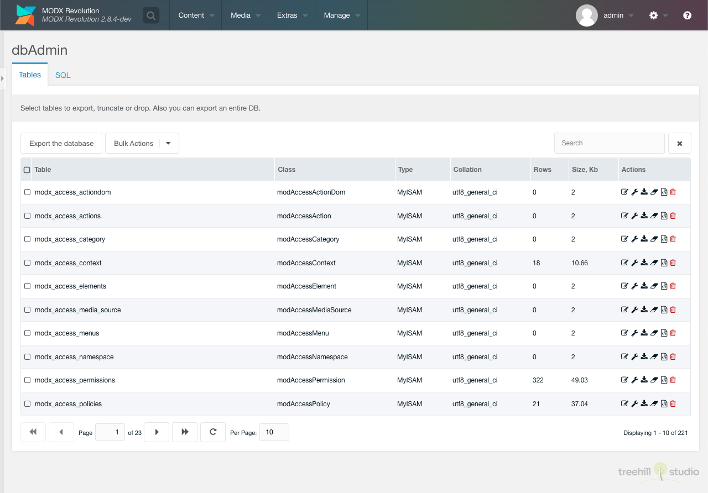

The custom manager page contains two tabs.

### Tables

The database tables grid in the Tables tab shows the tables of the current
database. Each table can be linked with the MODX system and extras object
classes. The content of each table that has the right object class assigned can
be edited and rows of the table can be deleted. The object classes are
automatically assigned on base of the existing namespaces in MODX during the
installation of dbAdmin.

The custom manager page is quite simple and intuitive. If you need to download
the entire database, press the `Export Database` button. If you like to export,
truncate or delete multiple tables, you can select the tables with the checkbox
and use the `Bulk Actions` button. To work with one table, you can use the icons
in the `Actions` column.



### SQL Queries

Another feature of the custom manager page is to execute SQL queries in the SQL
tab. In the input field at the top you can insert standard MySQL queries and
execute them with the `Execute` button. All tables that are linked with an
object class can be addressed with the following syntax:

```
select pagetitle, uri from {modResource}
```

The query result is shown at the bottom with the `print_r` or `var_export` syntax.


### Permissions

To work with the component the user must have appropriate rights:

- tables_list - Permission to display the tables grid.
- table_view - Permission to view the table content.
- table_save - Permission to save the table data.
- table_truncate - Permission to delete all records from a table (truncate table).
- table_remove - Permission to delete a table (drop table).
- table_export - Permission to export a table.
- sql_query_execute - Permission to export a table.

A sudo user is allowed to do everything.
